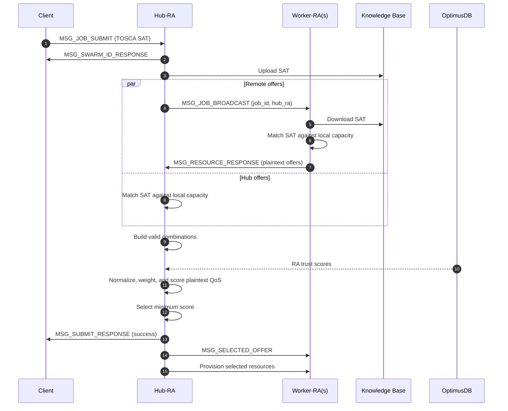
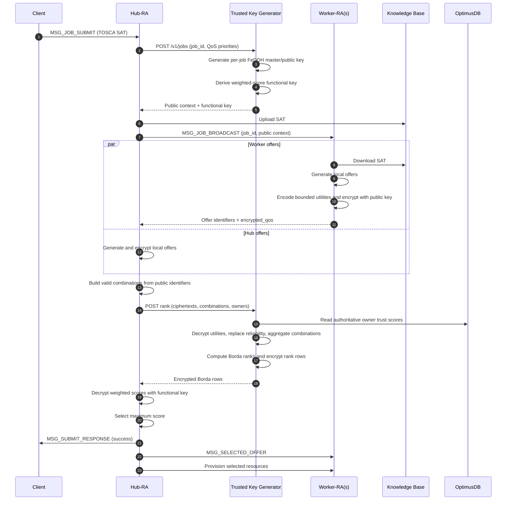

# Resource Agent workflow with private IPFE ranking

This document separates the original plaintext protocol from the implemented
trusted-key-generator (TKG) protocol.

## 1. Original protocol



The original Hub sees every offer characteristic. Its final score is a
normalized weighted cost with bandwidth inverted and reliability subtracted;
the lowest score wins.

## 2. Implemented TKG protocol



The TKG service is `src/trusted_key_generator.py`. The transport-safe
protocol and FeDDH serialization are in
`ipfe_resource_ranking/private_protocol.py`. `IPFE_TKG_URL` configures the Hub
endpoint and defaults to `http://trusted-key-generator:8000`.

## 3. Messages and data visibility

### Job setup

The Hub sends the job ID and QoS priorities to `POST /v1/jobs`. The TKG
returns:

- `public_context`: protocol version, job/key/config IDs, ordered metrics,
  directions, numeric bounds, scales, and FeDDH public key;
- `functional_key`: a key for the single weighted Borda function requested by
  the Hub.

The master key stays inside the TKG. Context fields are hashed into
`config_id`, and all later payloads must match the job, key, and config IDs.

### Offer response

Each RA keeps the full offer in its local capacity registry. Across the P2P
network it sends public allocation identifiers and an `encrypted_qos`
ciphertext. The plaintext `characteristics` mapping is removed. Reliability is
a placeholder: the TKG replaces it with the offer owner's OptimusDB
trust score, so an RA cannot improve its rank by self-reporting trust.

### Ranking request

The Hub can form feasible combinations using public identifiers. It sends the
TKG a map of unique encrypted offers, ordered lists of offer tokens for each
combination, and the RA owner of each token. The TKG returns only
encrypted Borda rows plus bound and identity metadata.

### Provisioning

After selection, each RA resolves the selected public offer ID back to its own
local full offer before accepting or provisioning it. Plaintext capacity data
therefore does not need to return through the Hub.

## 4. Mathematics

Let `j` identify a QoS metric and let its allowed raw interval be
`[L_j, U_j]`. The RA converts raw value `v_ij` to an integer utility in
`[0, Q]`, where `Q = value_scale`:

```text
maximize j: x_ij = round(Q * (v_ij - L_j) / (U_j - L_j))
minimize j: x_ij = round(Q * (U_j - v_ij) / (U_j - L_j))
```

The RA encrypts `x_i = (x_i1, ..., x_im)` under the per-job public key. For a
candidate combination `c`, the TKG decrypts and aggregates:

```text
u_cj = sum(x_ij for offer i in combination c)
```

It replaces the reliability coordinate with the same encoding of the trusted
OptimusDB value before aggregation. Across `N` combinations, Borda rank is:

```text
r_cj = |{d : u_dj <= u_cj}|
```

Ties receive the same maximum-position rank. Since all coordinates are already
utilities, larger is always better. A priority `w_j` becomes the nonnegative
integer `w'_j = round(weight_scale * w_j)`. The Hub's functional key reveals:

```text
s_c = sum(w'_j * r_cj for j = 1..m)
best_index = argmax_c(s_c)
```

The safe FeDDH discrete-log interval is
`[0, N * sum(w') + 1)`. JSON encodes cryptographic integers as decimal strings
to avoid loss in transit.

## 5. Privacy boundary and current limitations

- Worker RAs do not reveal plaintext QoS characteristics to the Hub.
- The Hub learns public offer/allocation identifiers, feasibility, every final
  combination score, and the winning index.
- The TKG can decrypt individual bounded utility coordinates because Borda
  ranks depend on comparing all offers. This is privacy from the Hub and peer
  RAs, not privacy from the TKG.
- The functional key does not give the Hub the master key or individual utility
  coordinates, but it does encode priorities the Hub already supplied.
- Transport authentication/TLS, signed contexts, range proofs, replay/expiry
  controls, persistent key storage, and threshold/multi-party trust are not yet
  implemented. Deploy the TKG only inside a trusted authenticated
  boundary until those controls exist.

## 6. Verification

`tests/test_private_ranking_protocol.py` covers JSON-safe distributed use,
combination aggregation, metadata mismatch rejection, context tampering, and
authoritative trust override. `tests/test_private_ranking_workflow.py` runs the
complete private-ranking workflow in process: real TKG HTTP routes, Hub and
Worker RA encryption/selection handlers, protected network payloads, a
Worker-owned winning combination, offer acceptance/rejection, master-info
fan-out, and transition to `Running`. Knowledge Base, P2P transport, trust
storage, and cloud/k3s provisioning use deterministic test doubles, so the test
does not create external infrastructure. The focused private-ranking suite now
contains 30 passing tests.
